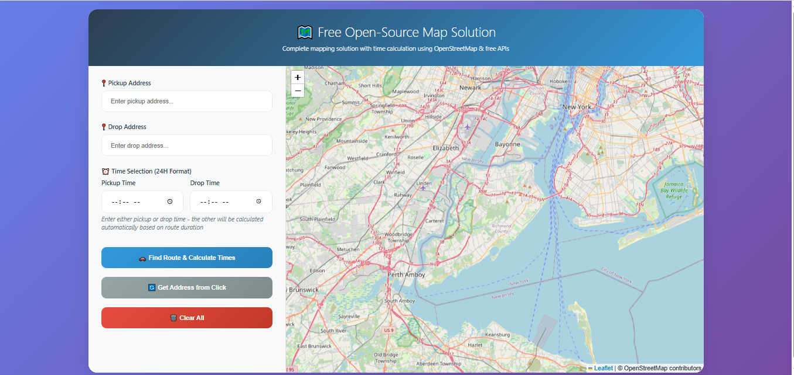

# 🗺️ Free Open-Source Map Solution

A **modern, open-source mapping solution** built with [Leaflet](https://leafletjs.com/), [OpenStreetMap](https://www.openstreetmap.org/), and free APIs.  
This project allows you to:

- Search pickup and drop addresses with **autocomplete**.
- Get **coordinates** and show them on the map.
- **Draw routes** between pickup and drop locations using OSRM (Open Source Routing Machine).
- View **distance and duration** of the route.
- **Auto-calculate pickup/drop times** based on route duration.
- Perform **reverse geocoding** by clicking on the map.

---

## ✨ Features

- 📍 **Address Autocomplete** (via Nominatim API)
- 🚗 **Route Calculation** (via OSRM API)
- ⏰ **Smart Time Handling**
  - Enter pickup time → auto-calculates drop time
  - Enter drop time → auto-calculates pickup time
  - Handles overnight trips (past midnight)
- 🔄 **Reverse Geocoding** (click map to get address)
- 📊 **Route Information Panel** (distance & duration)
- 🎨 **Modern UI/UX** with responsive design

---

## 🚀 Demo Screenshot



---

## 🛠️ Tech Stack

- **Frontend**: HTML5, CSS3 (modern responsive UI)
- **JavaScript**: Vanilla JS
- **Mapping**: Leaflet.js
- **APIs**:
  - [OpenStreetMap Nominatim](https://nominatim.org/) → Geocoding & Autocomplete
  - [OSRM](http://project-osrm.org/) → Routing & Duration

---

## 📂 Project Structure

```
.
├── index.html   # Main app file (HTML + CSS + JS in one file)
├── README.md    # Documentation
└── assets/      # (Optional) Store screenshots or custom icons
```

---

## ⚡ Getting Started

### 1. Clone this repository

```bash
git clone https://github.com/your-username/free-map-solution.git
cd free-map-solution
```

### 2. Open in Browser

Simply open the `index.html` file in your browser.  
No build tools, no backend setup required. ✅

---

## 🔧 Usage

1. Enter **Pickup Address** → Autocomplete will suggest results.
2. Enter **Drop Address** → Same autocomplete applies.
3. (Optional) Enter **Pickup Time** OR **Drop Time** → The other will be auto-calculated.
4. Click **Find Route & Calculate Times** → Displays route, distance, duration, and calculated times.
5. Use **Get Address from Click** → Click anywhere on the map to set pickup/drop from coordinates.
6. Use **Clear All** to reset the map and inputs.

---

## 🌍 APIs Used

- **Nominatim API** (Free) → Geocoding & Reverse Geocoding
  - Example: `https://nominatim.openstreetmap.org/search?...`
- **OSRM API** (Free public server) → Routing
  - Example: `https://router.project-osrm.org/route/v1/driving/...`

⚠️ **Note:** Both Nominatim and OSRM are public APIs with usage policies.  
For production, it’s recommended to host your own instances.

---

## 📱 Responsive Design

- 🖥️ Desktop → Two-column layout (controls + map)
- 📱 Mobile/Tablet → Stacked layout (controls above map)

---

## 🤝 Contributing

Contributions are welcome! 🎉  
You can help by:

- Improving the UI/UX
- Adding support for walking/cycling routes
- Adding multi-stop routing
- Adding localization

To contribute:

1. Fork the repo
2. Create a new branch (`feature/my-feature`)
3. Commit changes and push
4. Create a Pull Request

---

## 📜 License

This project is licensed under the **MIT License**.  
You are free to use, modify, and distribute it with attribution.

---

## 👨‍💻 Author

**Your Name**  
🌐 Website: [your-portfolio-link.com](#)  
🐦 Twitter: [@yourhandle](#)  
📧 Email: [your@email.com](#)
